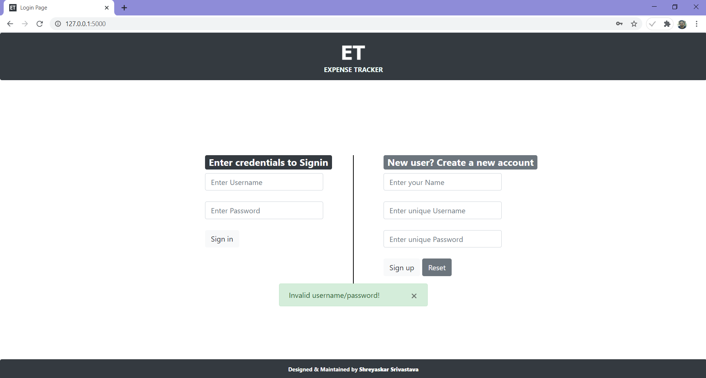
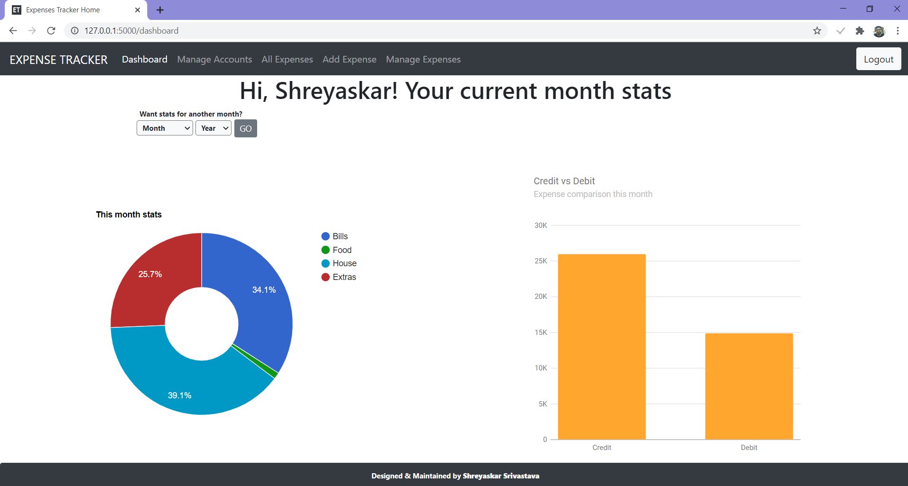
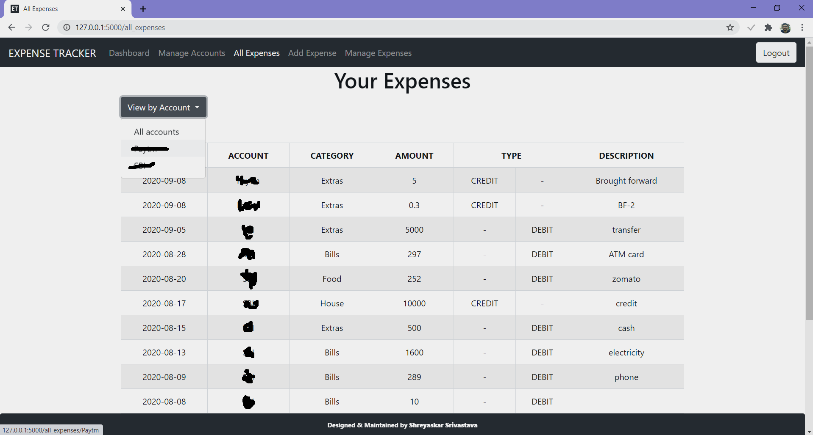
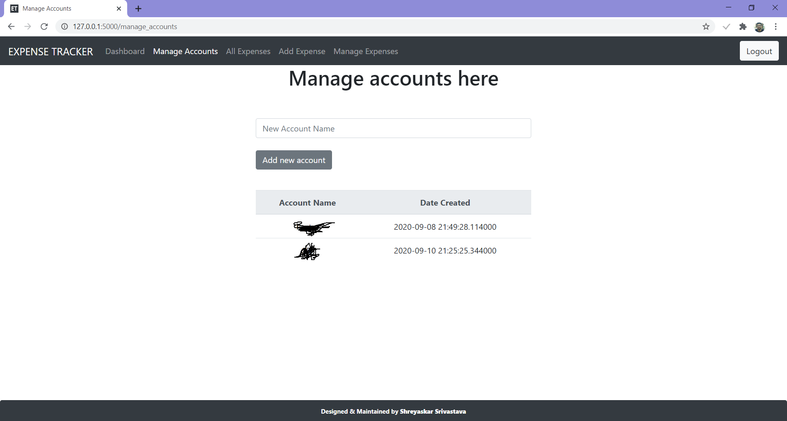
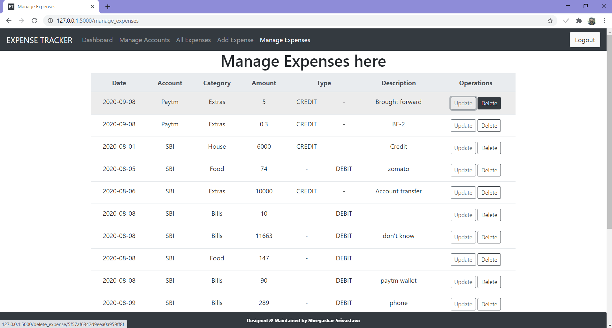

# Expense Tracker
- MongoDB
- Flask (Python)
- Bootstrap 4

## Features

- [x] User-login system along with new account creation (with encryption)
- [x] Multiple accounts handling
- [x] Sort All Expenses by Account
- [x] Add Expenses
- [x] Delete Expenses
- [x] List all Expenses 
- [x] Update Expenses

## Script execution
1. Install virtual environment
```
py -m venv expense-tracker
```

2. Change the directory (Linux)
```
cd expense-tracker/
```

3. Copy the repository in this directory

4. Activate the virtual environment
```
.\Scripts\activate
```
   *OR*
```
cd .\Scripts\
.\activate
```

5. Install required packages
```
pip install -r requirements.txt
```

6. Run main.py
```
py main.py
```

7. To deactivate the virtual environment
```
deactivate
```

## Screenshots

<div>

  
<br>
    
<br> 
  
<br> 
  
<br>  
  
<br>
  

</div>
